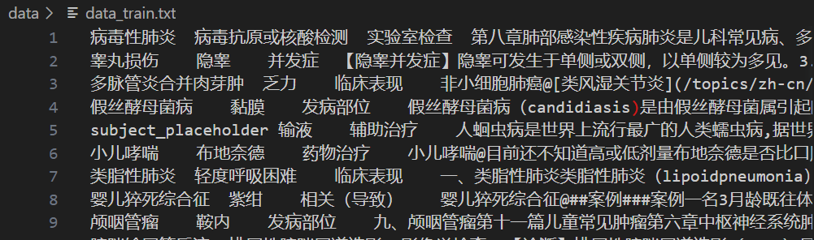
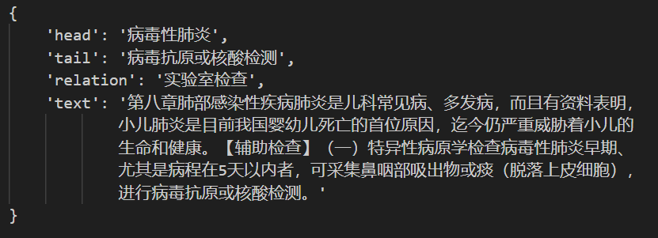
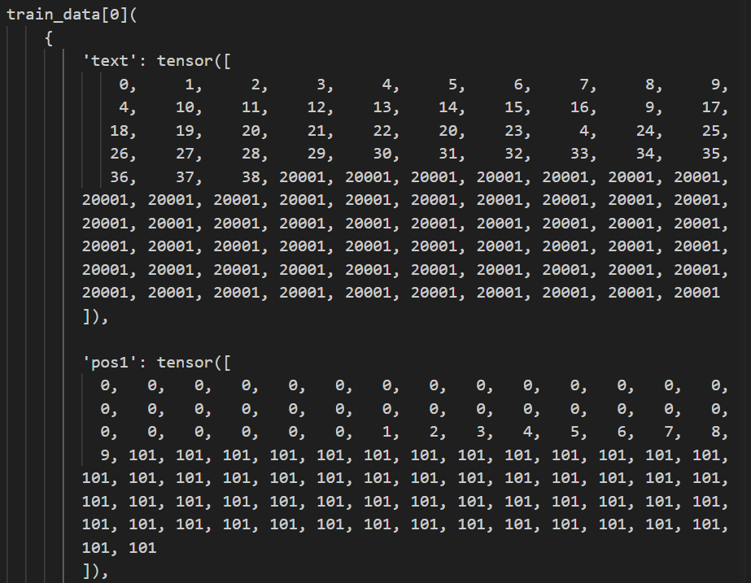
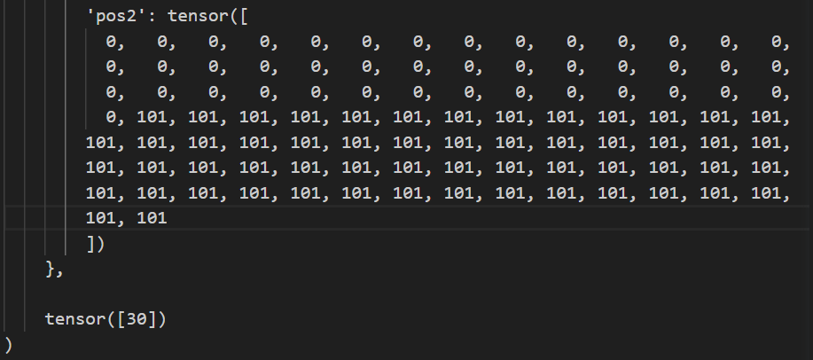

# Chinese-Medical-Relation-Extraction
 Text Classification Based on Chinese Medical Relation Extraction 基于中医关系抽取的文本分类 (NLP)

 

## Data overview

|     Data      | Details                                                      |
| :-----------: | :----------------------------------------------------------- |
| Download link | [data.zip](https://github.com/unicorn-yh/Chinese-Medical-Relation-Extraction/blob/main/data.zip) |
| Dataset size  | Train Dataset : 37965  Valid Dataset : 8186  Test  Dataset : 8135 |
| Train Dataset |  |

 

## About

1. Using raw and labeled data to build word embedding based on sentences and head-tail entities.
2. Build a suitable CNN for text relationship classification.
3. Train the model.
4. Predict the test set after the training is completed, and generate a prediction result file.

 

## What we do

- Extract the corresponding relationship from the given head entity, tail entity and sentence in dataset.

- Classify the sentence into a certain relationship according to the given entity. 

- Through CNN, it is mapped into a 44-dimensional short tensor ***(44 different classes)***, and finally through the Argmax function

- The relationship represented by the corresponding head entity, tail entity and sentence is obtained.

   

  ### <u>*Data Preprocess*</u>

  - **Vocab-to-index:** After the data is read in, a vocabulary list is constructed for sentences to convert them into index sequences corresponding to the vocabulary. 

  - **Position:** For the head and tail entities, find the corresponding position in the sentence, and convert the "symbol" into a "position". 

  - **Word-to-vector:** For labeled data, the corresponding relationship is converted to the corresponding relationship id through the W2V lookup table and stored in the dataset. We used the ***skip-gram*** model to encode data label, word frequency and W2V lookup table.

  - **Word embedding:** First, set the corresponding word embedding parameters according to the length of vocabulary. Do embedding for the read-in sentence.

  - **Feature extraction:** Use the head and tail entity position information and sentence information to do feature extraction through convolution and classification. 
  
    |           Data           | Details                                                      |
    | :----------------------: | :----------------------------------------------------------- |
    | Data after reorganizing  |  |
    | Data after preprocessing |  |

***About skip-gram:*** 

- Given a central word and a context word to be predicted, take this context word as a positive sample. Select several negative samples through random sampling of the vocabulary. 

- Then convert a large-scale classification problem into a **two-class classification** problem, and optimize the calculation speed in this way. We make a multinomial distribution sampling and take a specified number of high-frequency words as positive labels, and we obtain negative labels by removing positive labels. 

- The code uses a **sliding window** to scan the corpus from left to right. In each window, the central word needs to predict its context and form training data. 

- Some matrix operations on large vocabularies need to consume huge resources, so we **simulate the result of softmax by negative sampling**.

- The size of the vocabulary determines that our skip-gram neural network will have a large-scale weight matrix. All these weights need to be adjusted through hundred millions of training samples, which is very computationally resource-intensive, and very slow to be trained. 

- **Negative sampling solves this problem**, which is a way to increase the speed of training and improve the quality of the resulting word vectors. Unlike updating all weights for each training sample, negative sampling **only updates a small part of the weights for each training sample**, which **reduces the amount of calculation in the gradient descent process**. 

- We use a **unigram distribution** to select negative words, and the formula in the code is implemented as follows:

  
  $$
  P(w_{i}) = \dfrac{f(w_{i})^{3/4}}{\sum_{j=0}^{n}(f(w_{j})^{3/4})} \tag{1}
  $$
  

  $f(w_{i})$ is known as word frequency. 

  When we train the skip-gram model, we convert the dataset into an iterator, and take a batch of samples from the iterator. The Adam optimizer and backpropagation method are used in the training process, and then the word embedding vector in the model is normalized.

- The word embedding vector is written into *"skip-gram-model.txt"* for subsequent word embedding and model training.

  

   

### <u>*Data Preprocess*</u>

- **Vocab-to-index:** After the data i
